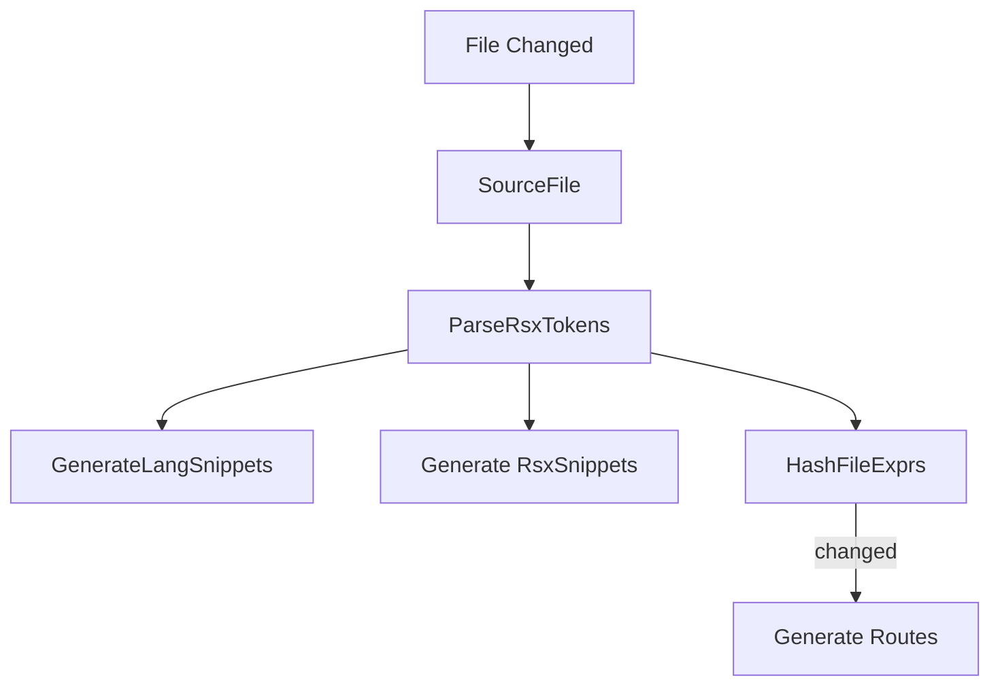

# Beet Build

Plugins for building a beet application, currently only for building websites.
The build process includes reactively passing information between the cli and the application.

## File Snippets
Export the lang snippets and rsx snippets collected by statically analyzing files, see [SnippetsPlugin](src/file_snippets/file_snippet_plugin.rs#L15).

Triggers:
- Startup - `load_all_template_files`
- A File specified in [`WorkspaceConfig`] changes - `load_changed_template_files`

## Route Codegen
Export the routes specified in `RouteCodegenConfig` into their respective paths, for example generating collection code for routes in `src/pages/..` into files in `src/codegen/..`, see [RouteCodegenPlugin](crates/beet_build/src/route_codegen/route_codegen_plugin.rs#L7).

Triggers:
- Startup - `RouteCodegenConfig::collections`
- A `FileExprHash` for a file specified in [`RouteCodegenConfig`] changes.

## Recompile Server

Recompile the server.

Triggers:
- A `FileExprHash` for a file specified in [`WorkspaceConfig`] changes, including output from route codegen.

## Server Output

Run the server with the `export-static` flag, which will generate ssg html files and a `ClientIslandMap` for each route.

Triggers:
- The server recompiles.
- The static scene output changes.

## Client Island Codegen

Generate the client islands entrypoint codegen, which will load/mount client islands as required. This step always results in recompilation of the wasm binary.

Triggers:
- The `ClientIslandMap` changed