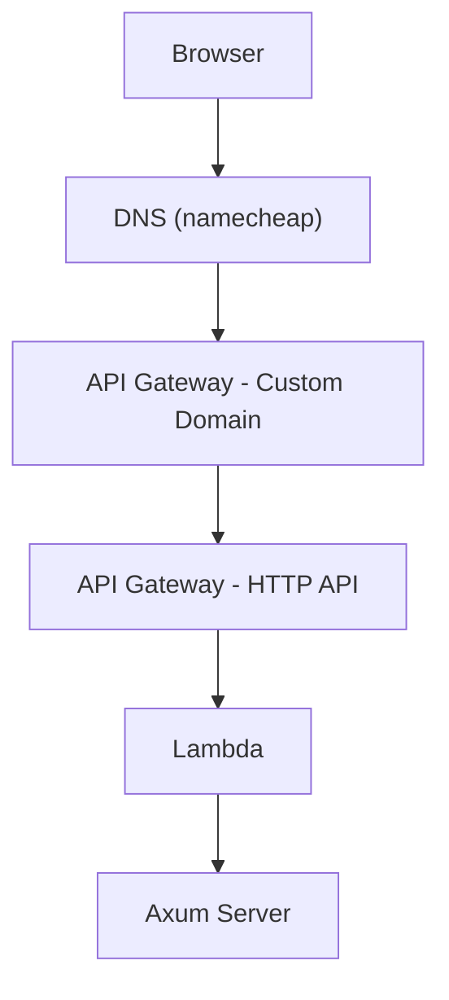

## Deploying to lambda

The process of pointing a url entered by a user to the serverless lambda function looks like this. It seems like a lot of steps but the good news is that there are absolutely no decisions to be made, its a standard setup that uses defaults all the way.



### IAM

For this tutorial we'll use the following:
- domain: `example.com`
- region: `us-west-2`
- bucket name: `example-bucket`
- IAM role name: `example-lambda-role`
- lambda name: `example-lambda`
- api gateway name: `example-api`

For cloud watch and s3 access we will need to set up a custom role. At first IAM roles may seem intimidating but it is a really nice system once you get the hang of it.

1. [Create Role](https://us-east-1.console.aws.amazon.com/iam/home?region=us-west-2#/roles/create)
	- Trusted Entity Type: AWS Service
	- Use case: Lambda
	- Permissions
		- AmazonS3FullAccess - buckets
		- AWSLambdaBasicExecutionRole - cloud watch
	- name: example-lambda
	- description: IAM Role for the Example axum server.
	- (optional) restrict s3 resources to example
2. Save the arn, we'll need it later

### Deploy the Server

This may vary depending on your setup, mine looks like this:

```sh
cargo lambda build 						\
	--package my_crate					\
	--features lambda						\
	--release
cargo lambda deploy			 			\
	example											\ # name of the function in the aws console
	--binary-name my_crate			\
	--region us-west-2 					\
	--iam-role $AWS_IAM_ROLE 		\ # this is the arn for the iam role we just created
	--enable-function-url 			\
	--include target/client 		\ # these are my static files
```


#### Environment Variables

If you need to set environment variables the aws cli can be used:

```sh
aws lambda update-function-configuration 				\
	--function-name example 											\
	--region us-west-2 														\
	--environment "Variables={ 										\
			MONGODB_CLIENT=$MONGODB_CLIENT					 ,\
			ANTHROPIC_API_KEY=$ANTHROPIC_API_KEY		 ,\
		}"
```

## Custom Domains

The default domain url generated by `cargo-lambda` is very long, lets connect it to a custom domain. There are three steps to do this:
2. Create TLS Certificate
1. Create HTTP API
3. Create Custom Domain


### Create TLS Certificate

1. Visit [ACM](https://us-west-2.console.aws.amazon.com/acm/home)
2. Request a certificate
3. Certificate type: Request a public certificate
4. Domain names: `example.com`
5. Validation method: DNS Validation
6. Key algorithm: RSA 2048
7. Create
8. Add the CNAME value to the sites DNS records
	- The 'CNAME name' will be the host `_84938943kdsjdsacd.example.com.`, so remove the trailing `.example.com.` when entering into your host.
	- The 'CNAME value' will be the value, copy and paste that directly.
9. Grab a coffee, we'll need this to be picked up by acm before creating the custom domain. For me this took 10 mins but it will probably vary greatly.

### Create HTTP API

1. Visit [API Gateway](https://us-west-2.console.aws.amazon.com/apigateway/main/apis) and create a new API
2. API type: HTTP API
3. API Name: `example-api`
4. Integrations: Lambda, same region, select function, default version
5. Configure Routes:
	- Resource Path: `$default` (this is a special catch-all name)
	- Integration Target: `example-lambda`
7. Configure stages: 
	- Stage name: `$default`
	- auto-deploy: `true`

### Create Custom Domain

1. Visit [Custom Domain Names](https://us-west-2.console.aws.amazon.com/apigateway/main/publish/domain-names)
2. Enter details:
	- Domain name: `example.com`
	- API Endpoint type: Regional
	- Minimal TLS version: 1.2
	- Mutual TLS authentication: false
	- ACM Certificate: `example.com` (the one we already created)
3. API Mappings > Configure API Mappings > Add New Mapping:
	- API: `example-api`
	- Stage: `$default`
	- Path: ``
4. Copy the 'API Gateway domain name':
	- note: this will not resolve when visited directly, its special and only for the dns
6. Create DNS Record:
	- type: CNAME
	- host: `@`
	- value: gateway domain name


## Troubleshooting

### OpenSSL Headers

`Failed to find OpenSSL development headers.`
Using crates like reqwest will pull in OpenSSL which it seems zig has a tough time with.

The rustiest solution to this is to use `rustls` instead of `openssl`:

```toml
reqwest = { version = "0.12", default-features = false, features = ["rustls-tls"] }
```

If this isn't an option try including openssl in your `Cargo.toml` with the `vendored` feature:
```toml
openssl = { version = "0.10", features = ["vendored"] }
```
For more info see [this stack overflow](https://stackoverflow.com/questions/76231924/cargo-lambda-build-does-not-find-openssl-development-headers)