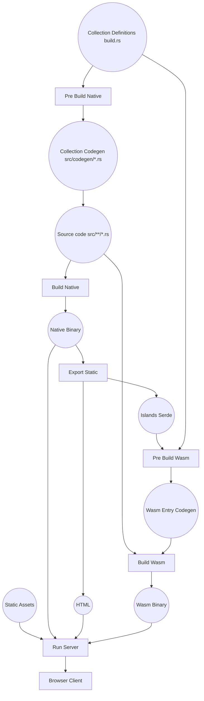

This chart contains the build steps for a typical Beet App.

```mermaid
graph TD;
    O(("Static Assets")) --> H;
    A(("Collection Definitions build.rs")) --> B["Pre Build Native"];
    B --> C(("Collection Codegen src/codegen/*.rs"));
    C --> E(("Source code src/**/*.rs"))
    E --> D["Build Native"];
    E --> F["Build Wasm"];
    D --> G(("Native Binary"));
    G --> H["Run Server"];
    G --> I["Export Static"];
    I --> J(("HTML"));
    J --> H;
    I --> K(("Islands Serde"));
    K --> L["Pre Build Wasm"];
    A --> L;
		L --> M(("Wasm Entry Codegen"));
    M --> F;
    F --> N(("Wasm Binary"));
    N --> H;
    H --> P;
    P["Browser Client"]
```
