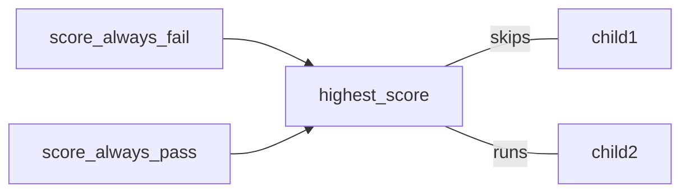
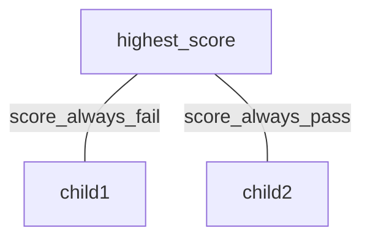

# Selectors

Selectors are actions that run on nodes with children, their job is to decide which child should run. In some paradigms selectors are also known as `planners`, `reasoners` or `thinkers`.

## Sequence

Perhaps the simplest selector is the `sequence`. It runs each child in order until completion, but will end if one fails.
```rs
#[tree_builder]
pub fn MyTree() -> impl TreeElement {
	tree! {
		<sequence>
			<say_hello/>
			<say_world/>
		</sequence>
	}
}
```

## Utility AI

Nodes can accept a `before_parent` attribute, which is an `action` that runs *before* the parent. It can be used to provide a `Score` for each child. Here's an example of an action that always sets its score to `Pass`. Other options are `Fail` or `Weight(u32)`

```rs
#[action]
fn score_always_pass<Node: AiNode>(query: Query<&mut Prop<Score, Node>>){
	for state in query.iter_mut(){
			**state = Score::Pass;
	}
}
```

This tree will skip `child1` and run `child2`:

```rs
#[tree_builder]
pub fn MyTree() -> impl TreeElement {
	tree! {
		<highest_score>
			<child1 before_parent=score_always_fail/>
			<child2 before_parent=score_always_pass/>
		</highest_score>
	}
}
```

It would produce the following system ordering:


Actions that determine scores are sometimes referred to as `considerations` , `conditions`, `filters`, or `scorers`.
It can also be helpful to think of them as the `edges` of child nodes when creating a diagram:

