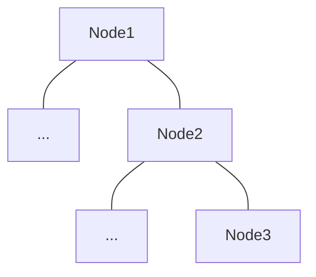
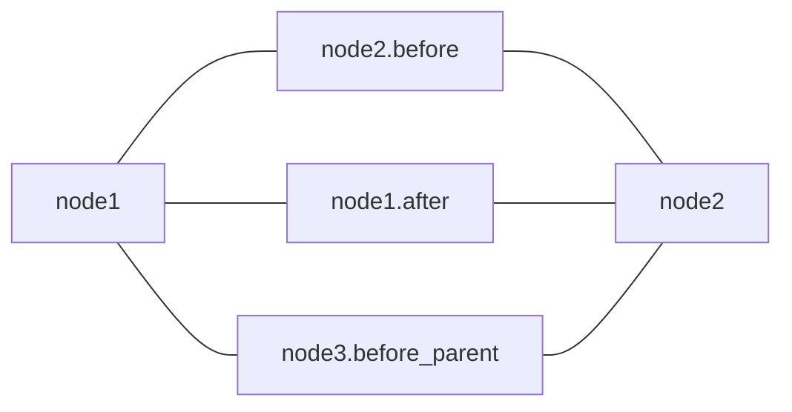

# System Ordering

Each action will run consecutively according to their depth, but for single-frame execution sometimes we need to run something before the parent.

System orderings are accessible via attributes, examples are:
- `before_parent` Useful for GOAP / Utility selectors, allows preparing of score for each child node of a selector.
- `before` - Do something before, ie skip.
- `after` Do something after, ie cleaning up run states.

```rs
tree!{
	<my_action
		before_parent = set_score
		before = cancel_if_elapsed
		after = cleanup
	/>
}
```

Consider the following tree:



It would produce this system ordering:


The ordering can also be viewed using [`bevy_mod_debug_dump`](https://crates.io/crates/bevy_mod_debugdump)

