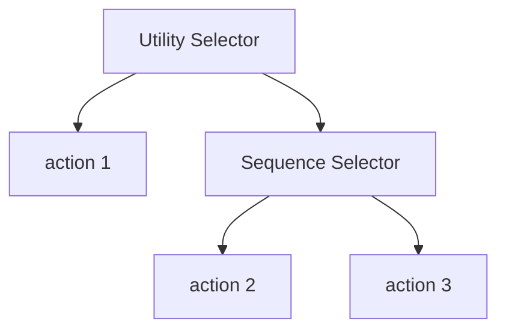

# Beet

Beet is a modular AI Behavior library that uses a novel `entity graph` approach to behavior selection. It is built with `bevy_ecs` and is suitable for creating autonomous agents in games, simulation and robotics.

<iframe src="https://mrchantey.github.io/beet/play/?spawn-bee=&spawn-flower=&hide-graph=&graph=CAAAAAAAAABOZXcgTm9kZQEAAAAAAAAAAAAAAAAAAD%2FNzMw9AAAAAAAAAAA"></iframe>

*Examples are built with the [beet playground](https://mrchantey.github.io/beet/play?spawn-bee=1), feel free to experiment with the bee's graph then spawn some to see the effect.*

## Features

### 🌈 Multi-paradigm

Using entity graphs we can mix-and-match techniques from different behavior selection approaches for each point in the graph, for example we can easily combine utility and behavior tree concepts:

#### Implementation status:

| Approach       | Status    |
| -------------- | --------- |
| Behavior Trees | ✅         |
| Utility AI     | ✅         |
| State Machines | 🚧         |
| GOAP           | Planned   |
| ML             | Possibly? |

### 🌳 Modular

The same components can be reused at different places in the graph and graphs can be composed of other graphs, allowing for epic code reusability.

### 🐦 Ecosystem friendly

All aspects of the library are just primitive components, and systems that work on them, which makes it incredibly easy to integrate into existing workflows, for example:
- Visualization - `bevy-mod-debugdump`
- Serialization - `bevy_reflect`
- UI - `bevy-inspector-egui`

This allows beet to ride on the wings of the incredible work already done by the bevy community.

### 🎯 Target Anything

Beet only depends on the lightweight architectural components of the bevy library, ie `bevy_ecs`, which allows it to target epic gaming rigs and tiny microcontrollers alike.

## Drawbacks

Everything's a tradeoff in engineering, using an entity graph does have limitations:

### Indirection

Actions and the agents they work on are seperate queries, which is a cache missed and an ergonomic painpoint. Its my hope that this will largely be mittigated by the introduction of [Entity Relations](https://github.com/bevyengine/bevy/issues/3742).

