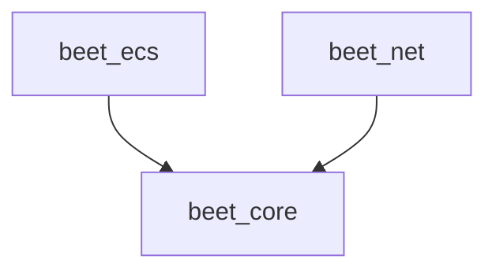

# Contributing

This repo is in a bit of a weird state for a rust project at the moment. I came from a web dev environment and in transitioning to rust I've carried a lot of project setup habits with me for better or worse.

For example:
- `mod.rs` files are automatically managed by `forky`, for this reason i have them set to hidden in `.vscode/settings.json`
- I'm using `sweet` for running tests which is basically a `jest` clone

## Crate structure
