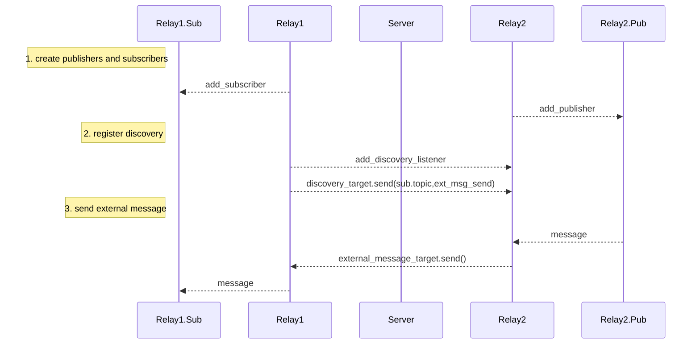
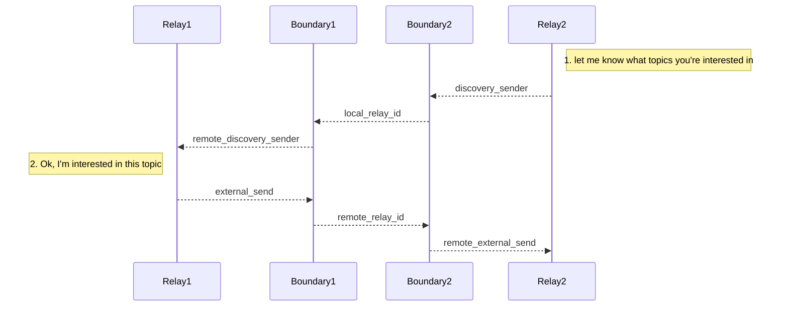
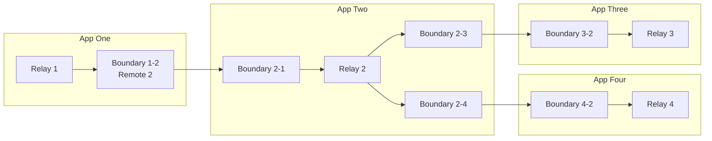

# Docs - Discovery

Discovery allows for inter-app communication.




## 1. Discovery

### Purpose

`relay2` always knows exactly what channels `relay1` has.

### Process
1. When a `discoveryTarget` is added to a relay, it is immediatly told about all existing `topicChannels`
	- The target relay processes the messagags on `process_discovery_messages`.
	- At this stage it adds the `ExternalMessageTarget`
2. when the first publisher or subscriber belonging to `relay1` is added (when the `topicChannels` created), everybody in its `discoveryTargets` is notified via `relay.send_discovery(DiscoveryMessage)`.


## 2. Exernal Messaging

### Purpose
When a publisher belonging to `relay1` publishes a message, it is received by a subscriber on `relay2`.
### Process

1. every `Publisher`, after its `send.broadcast()`, will notify its relay via `relay.send_external_message((topic,message))`.
2. The parent relay broadcasts it to each other relay in its `external_targets: HashMap<TypedTopic,Vec<ExternalTarget>>` vec.
3. The other relay receives the  message via `relay.handle_external_message((Topic,Message))`and broadcasts it via `topic_channels[topic].send(Message)` if it has any for that topic.

```pseudo
relay1.pub1.on_publish(|message| relay2.sub1.recv(message))
```

## 3. Boundaries


### Discovery over boundaries



## 4. Propagation



- TODO this is wrong, we need remote proxies, and seperate from that a sync.


### Purpose

Consider the connection of `App 1 <-> App 2 <-> App 3`. We


### Process

// TODO
