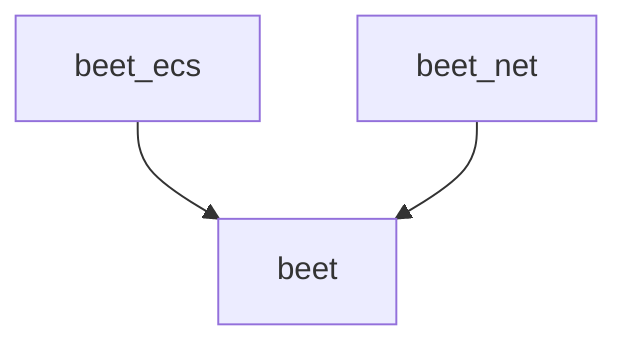

<h1>Beet</h1>
🌻🐝
<!--  -->

 

Beet is an AI behavior library for games and robotics.

> *Very early stage warning:*
> - breaking changes on patch versions
> - continued development not guaranteed
> - docs are wip
> - bugs ahoy

| Roadmap          |     |
| ---------------- | --- |
| Behavior Trees   | ✅   |
| State Trees      | 🚧   |
| GOAP             | 🚧   |
| Machine Learning |     |

## Crate structure
