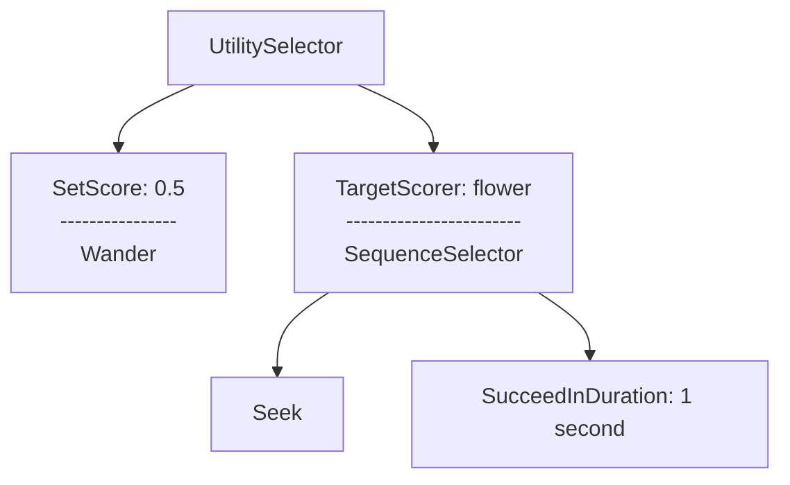

# Getting Started
<!-- keep all code references in sync with docs please -->

## Worked Example

Lets go through each action in the diagram:

1. `UtilitySelector`: This will choose the child to run with the highest score.
2. `SetScore`: Provides the parent with a constant score for this node.
3. `Wander`: The bee will move around the map somewhat randomly.
4. `TargetScorer`: This action has two roles:
   - Provide the parent with a score depending on whether a target named "flower" is nearby
   - Update `TargetEntity` component of its children.
5. `SequenceSelector`: Run each child in order until completion or one fails.
6. `SucceedInDuration`: Upon arriving at the flower, wait for 1 second to emulate pollination.

Notice how we are using these tiny actions to compose a behavior, every one of them is in the core library and we've created a behavior without writing any new code.

Furthermore this graph can very easily be attached as a `work mode` subgraph of a larger `bee` graph.

## Agent Lifecycle

1. A graph is defined containing the relationships between nodes and the initial values for each of their accompanying actions.
2. When creating an agent, call `my_graph.spawn(my_agent)` which will do the following for each node in the graph:
	- Create an entity
	- If it has any children, put their entity ids in an `Edges` component
	- Create a component for each action
3. When the agent is despawned, all entities in the graph are also despawned leaving no trace.