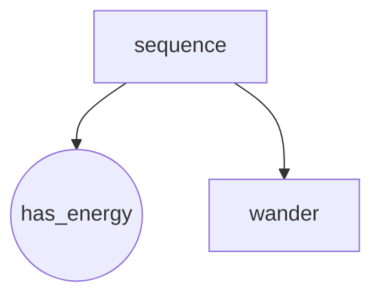

# Getting Started
<!-- keep all code references in sync with docs please -->

## Worked Example

Ok enough of the theory, let. Consider the following diagram for Billy the Bee 🐝 

```mermaid
graph TB;
    A-->B;
		A-->C;

A[sequence]
B((has_energy))
C[wander]
```