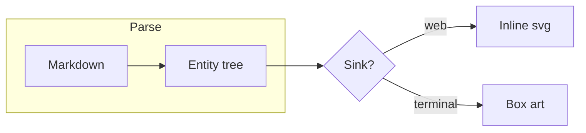
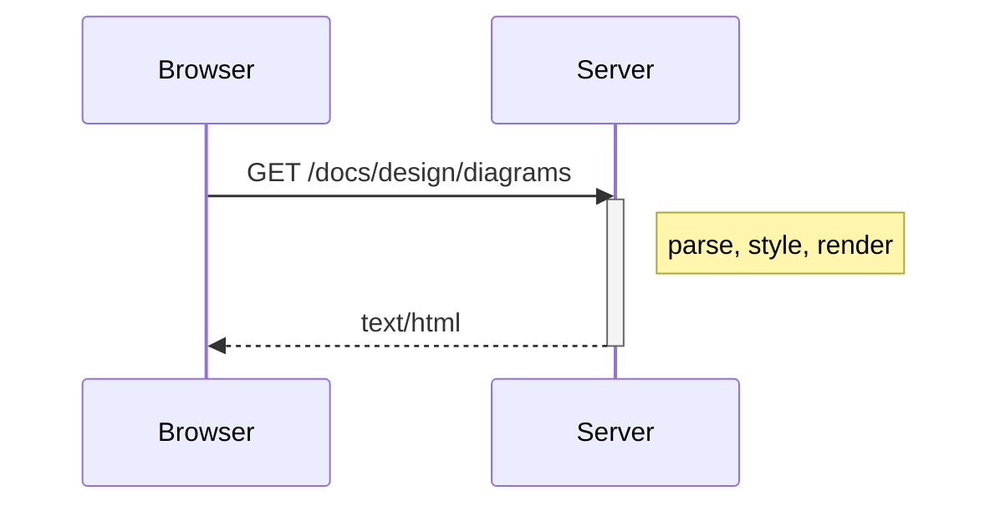
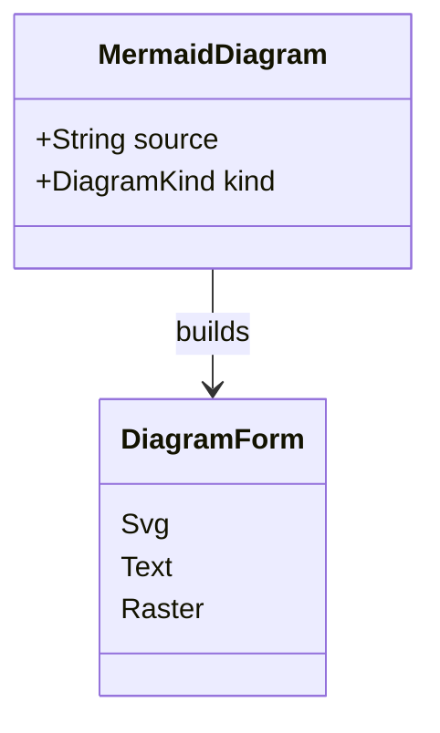
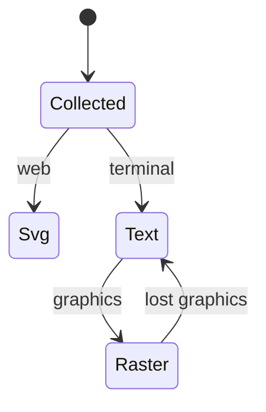
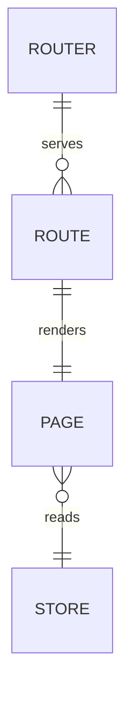
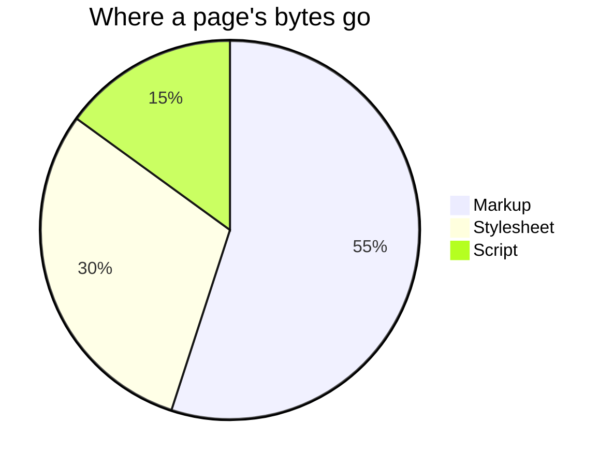
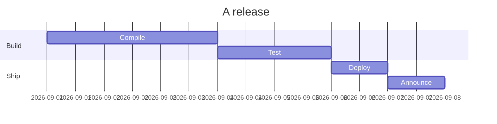
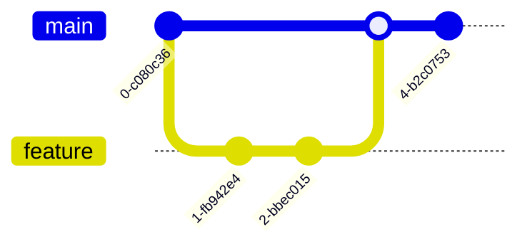
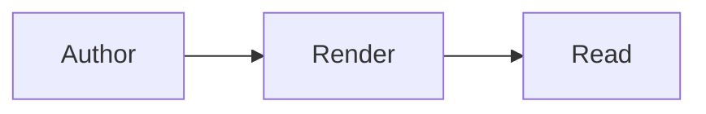

+++
title = "Diagrams"
+++

# Diagrams

A `mermaid` code fence renders as a diagram on every sink, painted by the material tokens so it follows the color scheme: a picture on the web, box-drawing text or a kitty raster on the terminal.

## Flowchart

## Sequence

## Class

## State

## Entity relationship

## Pie

## Gantt

## Git graph

## Text form

The info word after the language pins one fence, here to the box-drawing form on every sink:

## Markup

The `<Mermaid>` widget authors a diagram outside a fence: its source is the default slot's text, or a file read through the page's store, and `render` pins the form as the info word does.

<Mermaid src="docs/design/pipeline.mmd"/>

## Choosing the form

The form is the `diagram-render` cascade property, `Auto`, `Svg` or `Text`, inherited like a text property, so it is set at three grains: an app-wide `<Rule>` in the rule set, a page root's `bx:style="diagram-render=Text"`, or one diagram's fence info word (`mermaid text`) and `<Mermaid render="Text">` prop. `Auto` is the picture on the web; on a terminal a flowchart is text, since it reflows to the columns and selects, and every other type a raster where the session's terminal draws kitty graphics, else text. A build without the svg renderer shows the text form for every mode.
