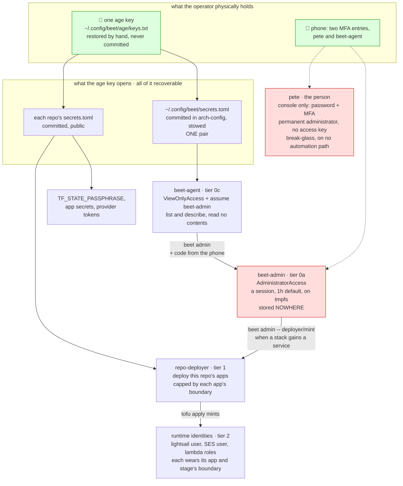

+++
title = "Secrets"
description = "From nothing to a checked secrets document: one age identity per person, a sealed document beside your entry, and the verbs that keep it honest."
+++

# Secrets

In this tutorial we will make an age identity, seal a secret into a document beside a beet entry, prove the launch loads it with no `.env` anywhere, let a second person and an agent read it, and open it with nothing but the `age` command line. By the end you will have a `secrets.toml` that `beet secrets/check` passes, that is safe to commit, and that you can read on any laptop without beet.

Two things before we start. Beet's secrets have no third-party service in them: the trust root is a per-person [age](https://age-encryption.org) identity, and every ciphertext beet writes is a plain age file. And the identity is per *person*, not per project or machine: the one you make here opens every document you are ever listed in, so you make it once and restore it everywhere else.

## What you need

The `beet` binary, and the `age` command line for the last section:

```sh
cargo install beet-cli
```

Install `age` from your package manager (`pacman -S age`, `brew install age`, `apt install age`).

## Write the entry

Make a directory and move into it:

```sh
mkdir secrets-lesson
cd secrets-lesson
```

Create `main.bsx` with this in it:

```jsx
<CallOnReady {CliServer}>
<Router {HelpHandler}>
	<Secrets/>
	<Route path="vault"><VaultRoutes/></Route>
	<Route path="secrets"><SecretsRoutes/></Route>
</Router>
</CallOnReady>
```

`<Secrets/>` declares the document, `secrets.toml` beside the entry. `<VaultRoutes/>` mounts the identity verbs and `<SecretsRoutes/>` the document verbs; `beet --help` lists them all.

## Make your identity

If you have already made one on another machine, restore it instead of making a second (the backup section says how); otherwise:

```sh
beet vault/keygen
```

```text
recipient: age1e6ngn99kzl9g77y3q2j72xv8m6a389zy6taphqyzvxh7z6k4laesyvr5zn
identity file: /home/you/.config/beet/age/keys.txt (1 identities)

Next:
1. back it up: `beet vault/backup --qr` onto a stick, and remember the passphrase
2. add the recipient wherever it should read: a secrets document's groups, or `--recipients` on `vault/encrypt` and `vault/rekey`
3. `beet secrets/check`
```

Notice that the *recipient* was printed and the identity was not. The recipient (`age1..`) is the public half, safe in any file; the identity (`AGE-SECRET-KEY-1..`) is the private half and stays in the identity file, which was created readable by you alone. Nothing you do from here on passes it in: every beet process finds it at that path.

Now run the check:

```sh
beet secrets/check
```

```text
✓ identity: 1 identities, recipients age1e6ngn9..
✗ document `secrets` (secrets.toml): not written yet (`secrets/set` writes a document, `<SecretsExport>` an export)
```

The identity resolves and the document does not exist yet. We will fix the second line in a moment; first, the backup.

## Back it up

An identity that exists on one disk is one disk failure from unreadable documents. Back it up now, before anything depends on it:

```sh
beet vault/backup --qr
```

```text
passphrase:
passphrase (again):
wrote `beet-identity-2026-09-21.age` (1 identities). Keep it on a stick in a drawer and remember the passphrase: nothing else can open it.
```

Followed by the same file as a QR code. Type a passphrase you will remember; it is never echoed and never on the command line. Copy the file onto a USB stick, print the QR code if you like paper, and delete the local copy. You have done the one step no verb can do for you: the stick goes in a drawer and the passphrase in your head.

On every machine after this one, you *restore* rather than generate. With beet installed that is `beet vault/restore-identity --file=<the backup>`, which asks for the passphrase and appends the identity to the machine's file, owner-only; before beet is installed it is `age -d -o ~/.config/beet/age/keys.txt <the backup>` into a directory you made first, then `chmod 600` on the file, since `age -d` writes it readable by everyone and beet refuses an identity file that is. A second `keygen` would make a second identity that can read nothing.

## Seal a secret

```sh
beet secrets/set DEMO_API_KEY --role=env_var --note="a demo key, made up for the tutorial" --rotation="manual:https://example.com/keys > New key"
```

```text
value:
INFO creating group `default` with this identity file's 1 recipient(s); edit its list in the document to add readers
set `DEMO_API_KEY` in group `default` of `secrets` (secrets.toml) (1 recipient(s))
```

Type any value at the prompt (it is not echoed) and press enter. Notice what went on the command line and what did not: the value is the only secret, and it was typed. The `note` and `rotation` are plaintext, which is the point of them: a year from now `ls` should say what this key is for and where a new one comes from, without anyone opening anything.

Now look at what you have:

```sh
beet secrets/ls
```

```text
`secrets` (secrets.toml): 1 group(s), 1 record(s)
group `default` (1 recipient(s)): opens
  DEMO_API_KEY  env_var  2026-09-21T04:29:39.992Z
      a demo key, made up for the tutorial
      manual:https://example.com/keys > New key
```

And at the file itself:

```sh
cat secrets.toml
```

```toml
[groups.default]
recipients = ["age1e6ngn99kzl9g77y3q2j72xv8m6a389zy6taphqyzvxh7z6k4laesyvr5zn"]

[groups.default.secrets.DEMO_API_KEY]
role = "env_var"
note = "a demo key, made up for the tutorial"
modified = "2026-09-21T04:29:39.992Z"
rotation = "manual:https://example.com/keys > New key"

[sealed]
default = """
-----BEGIN AGE ENCRYPTED FILE-----
YWdlLWVuY3J5cHRpb24ub3JnL3YxCi0+IFgyNTUxOSBvYnh6Umw4eDJIN0x6QXFG
..
-----END AGE ENCRYPTED FILE-----
"""
```

Read it top to bottom. The `default` group lists who may read it, which is you. Under it the *index*: one table per record with everything about it except the value. At the bottom, one age file per group holding the values. Everyone who can see this file can see which secrets exist, who reads them and when each last changed; only a listed recipient can open the blob. That is why the file is committed.

Run the check again and watch the second line change:

```sh
beet secrets/check
```

```text
✓ identity: 1 identities, recipients age1e6ngn9..
✓ document `secrets` (secrets.toml): 1 group(s), 1 record(s)
✓   group `default`: opens (1 recipient(s))
```

## Mint one

Some secrets are never typed anywhere, because nobody needs to know them: a state encryption passphrase, a database password. Make one:

```sh
beet secrets/set DEMO_PASSPHRASE --generate --role=env_var --note="a generated passphrase, nobody has ever seen it"
```

```text
set `DEMO_PASSPHRASE` in group `default` of `secrets` (secrets.toml) (1 recipient(s))
```

Thirty-two unambiguous alphanumerics from the platform's entropy source, sealed and never printed. This is how beet's own `TF_STATE_PASSPHRASE` was born.

## Use it, with no `.env`

Both records carry `role = "env_var"`. Run a command in their environment:

```sh
beet secrets/exec -- sh -c 'echo "DEMO_API_KEY is ${#DEMO_API_KEY} characters long"'
```

```text
INFO document `secrets` (secrets.toml): opened 1 of 1 group(s), 2 record(s), 2 env var(s) set
DEMO_API_KEY is 12 characters long
```

The count is whatever you typed. Notice the first line, which every beet command in this directory logs: the launch read `<Secrets/>` and set both records into the process environment *before* the entry built. Any verb you write here, and any tool it runs (`tofu`, `aws`, `curl`), finds them set, and there is no `.env` for them to have come from. A variable already in your shell wins over the document, so you can override one for a single run by exporting it.

Beet's test runner does the same: it loads the nearest `secrets.toml` above the crate under test, so a test that needs a credential finds it with nothing configured.

When you do need a value in front of you:

```sh
beet secrets/get DEMO_API_KEY
```

This is the one deliberate print. It goes to stdout so you can pipe it; mind what is recording your terminal.

## Change a note

Open `secrets.toml` in an editor, change the `note` line under `DEMO_API_KEY` to anything else, save, and run:

```sh
beet secrets/check
```

```text
✗   group `default` does not match the index (a document is edited through `secrets/set`, never by hand): `DEMO_API_KEY`: the index entry differs from its sealed copy
```

Every record's metadata is sealed inside the blob beside its value, and the index is only a mirror of it, so a hand edit of the index is caught rather than obeyed: nothing can promote a secret into the environment by editing a plaintext line. Put the line back as it was. The way to change a note or a rotation is to write the record again, with the value the launch just loaded:

```sh
beet secrets/set DEMO_API_KEY --from-env --role=env_var --note="a demo key, with a better note" --rotation="manual:https://example.com/keys > New key"
```

`--from-env` reads the value out of the process environment, where the launch put it, and re-seals it unchanged with the new text. Run `beet secrets/ls` and see the new note. The only lines you ever edit by hand are the `recipients` lists, which is the next step.

## Add a second reader

A second person makes their own identity on their own machine with `beet vault/keygen` and sends you the `age1..` line it printed. For this lesson we will stand in for them with a second identity file:

```sh
beet vault/keygen --out=/tmp/alice-keys.txt
```

```text
recipient: age1lk2scs0jagmlg4fus4edsuk5vvncz74u75xrlklzedj3gvczy3vsv24lxk
identity file: /tmp/alice-keys.txt (1 identities)
```

See the document as Alice sees it. `BEET_AGE_IDENTITY` names an identity file for one process, which is how an agent or a CI runner is handed one:

```sh
BEET_AGE_IDENTITY=/tmp/alice-keys.txt beet secrets/ls
```

```text
group `default` (1 recipient(s)): 🔒 not a member
  DEMO_API_KEY  env_var  2026-09-21T04:31:59.870Z
      a demo key, with a better note
      manual:https://example.com/keys > New key
```

She can see everything but the values. Now open `secrets.toml` and add her recipient to the list:

```toml
[groups.default]
recipients = ["age1e6ngn9..", "age1lk2scs0.."]
```

Run the check:

```sh
beet secrets/check
```

```text
✗   group `default`: opens, but its list changed since it was sealed: run `secrets/rekey` (2 recipient(s))
```

The list is the truth for the *next* seal; the blob is still sealed to the old one, and both you and `check` can tell. Re-seal:

```sh
beet secrets/rekey
```

```text
rekeyed `secrets` (secrets.toml): 1 group(s) re-sealed (default)
```

And prove Alice reads:

```sh
BEET_AGE_IDENTITY=/tmp/alice-keys.txt beet secrets/get DEMO_API_KEY
```

That is the whole ceremony for adding a human: their recipient into the list, one `rekey`, commit. Removing one is the same edit in reverse plus a rotation of everything they could read, since git history keeps the old ciphertext; the stack section below has the verb for it.

## Give an agent its own group

Humans are listed in every group. A non-human identity, an agent that deploys or reads one API, is listed only in the groups it is granted. Make its identity the same way, then seal a record into a new group:

```sh
beet vault/keygen --out=/tmp/agent-keys.txt
beet secrets/set DEMO_AGENT_TOKEN --group=agents --role=env_var --note="a token the agent may read"
```

```text
value:
INFO creating group `agents` with this identity file's 1 recipient(s); edit its list in the document to add readers
set `DEMO_AGENT_TOKEN` in group `agents` of `secrets` (secrets.toml) (1 recipient(s))
```

Add the agent's recipient to the `agents` list only, `rekey`, and look at the document through its eyes:

```sh
beet secrets/rekey
BEET_AGE_IDENTITY=/tmp/agent-keys.txt beet secrets/ls
```

```text
group `agents` (2 recipient(s)): opens
  DEMO_AGENT_TOKEN  env_var  2026-09-21T04:30:25.838Z
      a token the agent may read
group `default` (2 recipient(s)): 🔒 not a member
  DEMO_API_KEY  env_var  2026-09-21T04:31:59.870Z
  ..
```

One file, two readerships. A process launched with the agent's identity in `BEET_AGE_IDENTITY` gets exactly `DEMO_AGENT_TOKEN` in its environment and nothing from `default`.

## Open it without beet

Everything above is a plain age file, so the disaster-day tool is the `age` binary and your identity file. Copy the `default` blob out of `secrets.toml`, from `-----BEGIN AGE ENCRYPTED FILE-----` to `-----END AGE ENCRYPTED FILE-----`, into a file; this does it in one line:

```sh
sed -n '/^default = """/,/^"""/p' secrets.toml | sed '1d;$d' > /tmp/default.age
age -d -i ~/.config/beet/age/keys.txt /tmp/default.age
```

```toml
recipients = ["age1e6ngn9..", "age1lk2scs0.."]

[secrets.DEMO_API_KEY]
value = "the value you typed"
role = "env_var"
note = "a demo key, with a better note"
modified = "2026-09-21T04:31:59.870Z"
rotation = "manual:https://example.com/keys > New key"

[secrets.DEMO_PASSPHRASE]
value = "iM3cNW72rnX2PPZDH5pxMjcBwN6vEye3"
..
```

The plaintext is the group as toml: every value beside the metadata you already saw, and the list it was sealed to. The same command opens your backup (`age -d beet-identity-2026-09-21.age`, with the passphrase) and any age file beet wrote by path. To make one of those, the `vault` verbs take a file rather than a record:

```sh
echo "a private key or a certificate" > cert.pem
beet vault/encrypt --vault=cert.pem.age --file=cert.pem
beet vault/decrypt --vault=cert.pem.age
age -d -i ~/.config/beet/age/keys.txt cert.pem.age
```

Both print the line back. `--group=agents` on `vault/encrypt` borrows a document's recipient list instead of retyping it.

## You have built

A per-person identity with a backup it can be restored from, a committed document whose index anyone can read and whose values only its listed recipients can, one group for humans and one for an agent, and the launch loading the records into every process that runs beside it. `beet secrets/check` passes for you and for Alice, and `age -d` opens everything with beet uninstalled. Delete `/tmp/alice-keys.txt` and `/tmp/agent-keys.txt` when you are done with them.

## The same document on a stack

Everything a deploy mints (a relay credential, a bucket token, a mailbox password, a DKIM key) lives in the stack's *secret store*, parameter store on AWS, behind one seam, and is never in a document by hand. What the document does for a stack is three verbs, each a route in the stack's entry.

**Export.** A deploy ends by writing the whole store into a document of the same type, sealed to the recipients of the entry's own `secrets.toml`, so the humans are listed once. The three, mounted beside the stack's other verbs (the export is a step other groups share, the other two answer a report and ride their routes):

```jsx
<Route path="secrets/export" {ExchangeSequence}>
	<SecretsExport document={$mail_secrets}/>
	<SecretsExport document={$mail_cold} dated=true/>
</Route>
<Route path="secrets/restore" {SecretsRestore}/>
<Route path="secrets/revoke" {SecretsRevoke}/>
..
<Secrets bx:ref="mail_secrets" label="mail-prod" path="infra/secrets/mail--prod.toml"/>
<Secrets bx:ref="mail_cold" label="mail-cold" path="secrets/export.toml" {StoreRef($cold_backups)}/>
```

The first is a committed file, overwritten only when a secret changed, so git holds the history; the second is a dated series in a bucket at another vendor. An export's records are named by label (`dkim-example-com`) with the provider's `address`, the `note` the mint wrote and its `rotation` (`replace:<resource>` for what an apply derives, `remint` for what a create-if-missing step mints, `manual:<how>` for what only a hand rotates), so `beet secrets/ls --document=mail-prod` reads as a ledger of what the stack holds and how each rotates.

**Restore.** `<SecretsRestore/>` is the inverse: `beet mail/secrets/restore --document=mail-prod --stage=prod` writes every record back into the store by label, which is how a fresh account or a rebuilt stack starts with the DKIM key its published selector expects rather than a new one. It refuses where the store already holds a label unless you pass `--force`.

**Revoke.** Removing a person is their recipient out of every list by hand, then `beet mail/secrets/revoke --recipient=age1.. --stage=prod --dry-run` to read the ledger and the same without `--dry-run` to act: every document is re-sealed, every `replace` secret is replaced by an apply, every `remint` one is deleted and re-minted by the deploy, and the `manual` residue is printed with its reason. It never claims a rotation it did not perform.

[Self-hosted mail](/docs/mail) section 9 is where these run for real, and the [`beet_infra` README](https://github.com/mrchantey/beet/blob/main/crates/beet_infra/README.md#secrets) covers the seam: `SecretStore`, the two providers that ship (`<SsmSecrets/>` for parameter store, `<DocumentSecrets path=".."/>` for a document as a stack's store), and what a downstream provider (1Password, a KMS) implements, which is one trait, one declaration and one attach observer.

## Who holds what: the credential model

Every credential in beet's own AWS account sits on one line: **power and frequency are inversely related, and the line between them is a human factor.** A thing that happens constantly is low power; a thing that is high power is rare and needs something an automated process cannot supply. The corollary is what makes the design tractable: "requires a human" and "an agent cannot reach it" are the same sentence, because an agent cannot type a six-digit code off a phone.



| tier | who | how often | credential | worst case |
| --- | --- | --- | --- | --- |
| 0a admin | the operator, and any agent on the machine for the session after | a few times a year | `beet admin`: a code mints a session (1h default, up to 12h) | unrecoverable, hence the phone |
| 0c read | agents, constantly | constantly | `beet-agent`, sealed in the global document | metadata disclosure |
| 1 deploy | the operator and CI | daily | `<repo>-deployer`, sealed in that repo's document | its own app, recoverably |
| 2 runtime | the servers | continuous | minted by an apply, held by nobody | its own app's data |
| break-glass | the operator, in the console | when 0a is broken | `pete`: password + MFA, no key | full admin, behind a phone and a browser |

**The invariant: the age key unlocks everything that is recoverable, and nothing that is not.** That is what decides which box a credential goes in. A deployer can destroy its own app's buckets, but every one is versioned and `force_destroy=false`, and a permissions boundary stops it creating anything more powerful than itself. `beet-agent` can read metadata and nothing else. Administrator rights are not recoverable in that sense, so they live in no document at all: `beet admin` mints them from a code, writes them to tmpfs, and they die with the session. The `pete` user is the human's own break-glass, never on an automation path, and it holds no access key, so nothing on the machine can pick it up by accident.

This is also why the sealed documents may live in public repositories. age's security rests entirely on the private key, so the question is never "is ciphertext safe" but "what does that one key unlock", and the answer is bounded by construction.

Four flows, day to day:

- **`just cli deploy`** opens the repo document for the deployer's pair, and `tofu` mints the runtime identities wearing their boundary. You, or CI holding the age key.
- **`beet aws -- s3 ls`** opens the global document for `beet-agent`. Lists names, reads nothing. What an agent gets by default, and it says so on stderr.
- **`beet admin --duration=30m`** asks for a code and mints a session; for that half hour `beet aws` runs as `beet-admin` and says so. **`beet admin -- deployer/mint`** is how a deployer's policy is re-minted when a stack gains a service: rare, one code.
- **the console, as `pete`** with a password and a code, for the day `beet admin` is itself what is broken. Behind that, the account root user.

A new machine is: clone arch-config, `stow`, restore the one age key from your password manager. Every document opens. `beet admin` additionally wants the phone.

## Where to go next

The [`beet_net`](/docs/crates/beet_net) crate holds the verbs and the [`beet_core`](/docs/crates/beet_core) crate the document and the age primitives; `beet vault/keygen --help` and friends document every flag. If you have not written a beet router before, [A guestbook from a scene](/docs/tutorials/guestbook-scenes) is half an hour and explains the `main.bsx` you pasted at the top.
